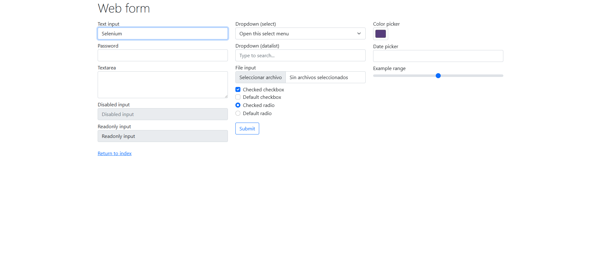
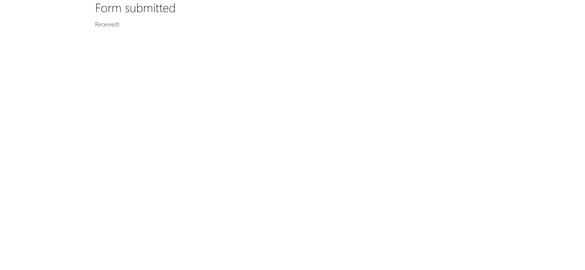
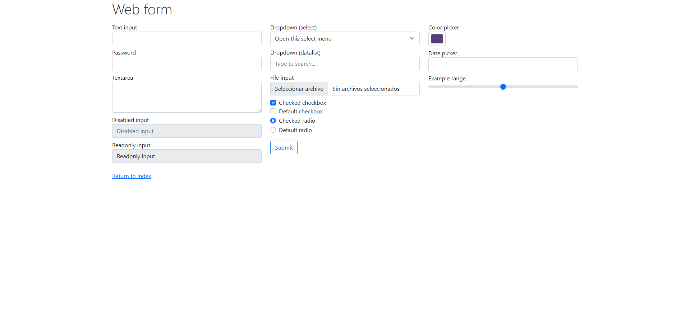
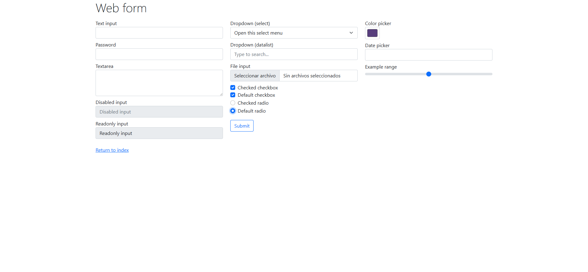

<div align="center">
  <table>
    <thead>
      <tr>
        <th>
          
        </th>
        <th>
          <span style="font-weight:bold;">UNIVERSIDAD LA SALLE DE AREQUIPA</span><br />
          <span style="font-weight:bold;">FACULTAD DE INGENIERÍAS Y ARQUITECTURA</span><br />
          <span style="font-weight:bold;">DEPARTAMENTO ACADEMICO DE INGENIERÍA Y MATEMÁTICAS</span><br />
          <span style="font-weight:bold;">CARRERA PROFESIONAL DE INGENIERÍA DE SOFTWARE</span>
        </th>
      </tr>
    </thead>
  </table>
</div>

<div align="center">
  <h2 style="font-weight:bold;">EJEMPLO DE USO - SELENIUM</h2>
</div>

## Tecnologías utilizadas

[![Node.js][Node]][node-site]
[![TypeScript][TypeScript]][typescript-site]
[![Selenium][Selenium]][selenium-site]
[![Vitest][Vitest]][vitest-site]
[![Git][Git]][git-site]
[![GitHub][GitHub]][github-site]

[Node]: https://img.shields.io/badge/Node.js-339933?style=for-the-badge&logo=node.js&logoColor=white
[node-site]: https://nodejs.org/

[TypeScript]: https://img.shields.io/badge/TypeScript-3178C6?style=for-the-badge&logo=typescript&logoColor=white
[typescript-site]: https://www.typescriptlang.org/

[Selenium]: https://img.shields.io/badge/Selenium-43B02A?style=for-the-badge&logo=selenium&logoColor=white
[selenium-site]: https://www.selenium.dev/

[Vitest]: https://img.shields.io/badge/Vitest-6E9F18?style=for-the-badge&logo=vitest&logoColor=white
[vitest-site]: https://vitest.dev/

[Git]: https://img.shields.io/badge/Git-F05032?style=for-the-badge&logo=git&logoColor=white
[git-site]: https://git-scm.com/

[GitHub]: https://img.shields.io/badge/GitHub-181717?style=for-the-badge&logo=github&logoColor=white
[github-site]: https://github.com/

## Tareas

1. Ejecutar el ejemplo de la página [Using Selenium](https://www.selenium.dev/documentation/webdriver/getting_started/using_selenium/) y subir evidencia (screenshots) de la ejecución.
2. Crear un nuevo ejemplo con el **checkbox** y **radio button** de la página [Web Form](https://www.selenium.dev/selenium/web/web-form.html).

---

## Comandos

Instalar dependencias:

```bash
npm install
```

Ejecutar todas las pruebas:

```bash
npm test
```

Ejecutar solo la Parte 1:

```bash
npm run test:usando-selenium
```

Ejecutar solo la Parte 2:

```bash
npm run test:checkbox-radio
```

---

## Parte 1: Ejemplo oficial de Selenium

Se implementó la prueba descrita en la documentación oficial de Selenium. El test realiza los siguientes pasos:

- Abre el formulario en [web-form.html](https://www.selenium.dev/selenium/web/web-form.html)
- Verifica que el título de la página sea `"Web form"`
- Localiza el campo de texto por su atributo `name="my-text"` y escribe `"Selenium"` letra por letra
- Hace clic en el botón **Submit**
- Espera a que aparezca el elemento con `id="message"` y verifica que su texto sea `"Received!"`

### 1. Página cargada

Al iniciar el test se abre el formulario y se verifica que el título sea `"Web form"`.


### 2. Texto ingresado

Se escribe `"Selenium"` letra por letra simulando la velocidad de escritura humana.



### 3. Mensaje recibido

Tras hacer clic en **Submit**, se verifica que el mensaje de respuesta sea `"Received!"`.



---

## Parte 2: Checkbox y Radio Button

Se crearon cuatro pruebas que interactúan con los elementos de selección del formulario:

- **Prueba 1:** Verifica que `"Checked checkbox"` (`my-check-1`) esté marcado por defecto al cargar la página.
- **Prueba 2:** Verifica que `"Default checkbox"` (`my-check-2`) esté desmarcado, hace clic sobre él y confirma que quede marcado.
- **Prueba 3:** Verifica que `"Checked radio"` (`my-radio-1`) esté seleccionado por defecto al cargar la página.
- **Prueba 4:** Verifica que `"Default radio"` (`my-radio-2`) esté deseleccionado, hace clic sobre él y confirma que quede seleccionado.

### 4. Página cargada

Se abre el formulario antes de comenzar las interacciones.


### 5. Checkbox 1 marcado por defecto

Se verifica que `"Checked checkbox"` (`my-check-1`) ya esté marcado al cargar la página.



### 6. Checkbox 2 desmarcado

Se verifica que `"Default checkbox"` (`my-check-2`) esté desmarcado inicialmente.


### 7. Checkbox 2 marcado

Se hace clic sobre `"Default checkbox"` y se verifica que quede marcado.


### 8. Radio 1 seleccionado por defecto

Se verifica que `"Checked radio"` (`my-radio-1`) ya esté seleccionado al cargar la página.


### 9. Radio 2 deseleccionado

Se verifica que `"Default radio"` (`my-radio-2`) esté deseleccionado inicialmente.


### 10. Radio 2 seleccionado

Se hace clic sobre `"Default radio"` y se verifica que quede seleccionado.


